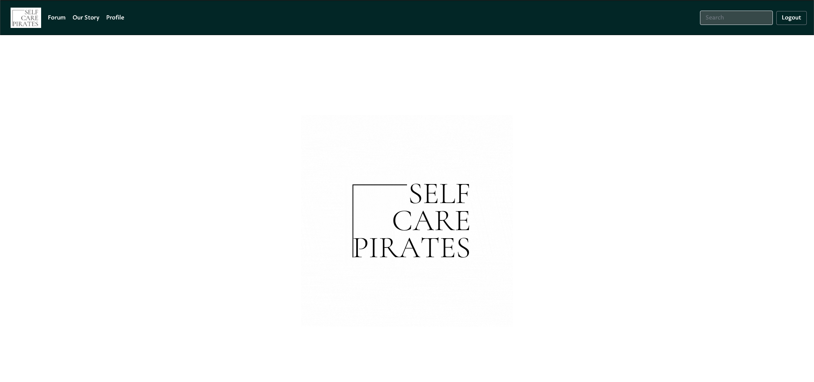

# Self-care pirates
  
  # Table of Contents
1. [Description](#description)
2. [Installation](#installation)
3. [Usage](#usage)
4. [Contributing](#contributing)
5. [Tests](#tests)
6. [License](#license)
7. [Questions](#questions)
## Description
* SCP is a men oriented self-care content and discussion website. Registered members submit content to the site such as links, text posts, and images, which are then can be commented on and shared.
## Installation
* Use deployment link below
## Screenshot

## Usage
* Post, comment and share
## Contributing
* When contributing to this repository, please first discuss the change you wish to make via issue, email, or any other method with the owners of this repository before making a change. Please note we have a code of conduct, please follow it in all your interactions with the project.
## Tests
* No
## License
* A short and simple permissive license with conditions only requiring preservation of copyright and license notices. Licensed works, modifications, and larger works may be distributed under different terms and without source code.
## Questions
  * Our Team:
  * https://github.com/candygarcia014
  * https://github.com/Juzva8
  * https://github.com/ttngu
  * https://github.com/ShanniSnax
  * https://github.com/cgconverse